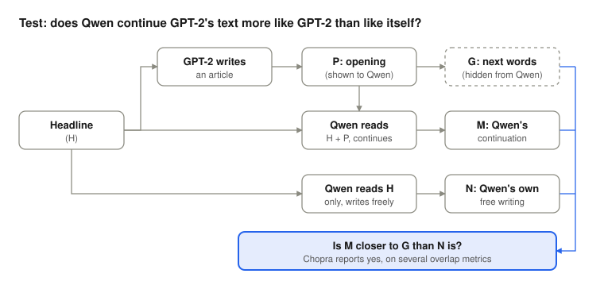

# Can AI introspect?

This week, towards the end of the week, I found myself thinking about how effective I had been. It was very interesting to look through the stats behind how many messages I've responded to, how many emails I'd sent, and exactly what time of day I had done this. After thinking through some of the stats and making some improvements for the week ahead, it got me thinking further about introspection, and how it might relate to AI.

![[introspection.jpg]]
## What is introspection?

It occurred to me that looking inward, and finding ways to improve ourselves, is a natural human trait. So I looked up the definition of introspection, which is:

"the ability to examine your own thoughts, feelings and reasoning, and to report on them."

It's the kind of thing that makes us self-aware and allows us to learn from our mistakes.

Why did I choose just after lunch on Friday? And why did I decide, in this particular week, that I needed to carry out an analysis of how I worked? I couldn't really tell you. But I did. And I think it's true that introspection is a trait that most of us find at some point. A we will see it's not easy to explain why we think in this way, so it should perhaps not be a supprise that it's hard also to think about AIs being introspective.

## Do AIs experience introspection?

The obvious reaction would be to say no, because an LLM just predicts the next word. It does have a model of how the world interrelates, but there isn't really a kind of inner life for them to look into. And so anything it says about its own thinking is really just a guess or a trick.

So I got myself thinking: is that reaction right? Or have I jumped to a conclusion a bit too quickly? Could AI, and specifically LLMs, experience introspection?

## Why we might expect it

To think about that, let's think about LLMs. They are in fact trained to predict human-written text, and to do that they have to be able to model the things that produce that text. So they're producing models of people: the things that they believe, the way that they think and the way that they reason.

If you were to look at the information that the models are trained on, it is trained, at least in part, on human text, and humans do think constantly about themselves. They say things like, "Oh, I think this," "I'm not too sure," "I've changed my mind." And so that behaviour itself will be included in the training data for LLMs.

## How might introspection emerge?

So the next logical step is to think about how that introspection behaviour might emerge. There are probably a couple of ways.

The first thing that could be happening is that the models could be imitating the way that humans respond. So they could be sounding introspective because we do: a kind of fake introspection, if you like.

But the other thing that could be happening is that a model may be representing itself, and its own outputs, within itself, in order to predict better.

Now, to work out if either of those things are happening, well that's quite a hard question to answer, because the internal models of LLMs are not human-readable. And actually, if you think about it, that is the same problem that we have. We can't necessarily reason how or why we are introspective any more than AIs can.

## What do we know about human introspection?

So that got me thinking about human introspection and what we actually know about it. And actually, that's not an easy question to answer either. There are a number of different papers, bits of research and writing, some of it sceptical. There is [work in psychology](https://hdl.handle.net/2027.42/92167) that points to the fact that people can't really identify what influences their judgements and behaviour. When asked, they just give explanations that are built from their knowledge of how other people act.

One example is [choice blindness](https://lup.lub.lu.se/record/679502), where participants in studies didn't notice when the outcome of their choice had been secretly swapped for an option that they hadn't chosen, and yet they still gave reasons for their own choice.

However, there is also some research that looks at people like [meditators](https://www.ncbi.nlm.nih.gov/pmc/articles/PMC3458044/), coaches and other professions. There have been some findings that say that they were much more accurate at reporting on themselves: sensations around the body, and accurate representations of their own thinking. I've included some links to some of these studies, because they're quite interesting.

Really, it's clear that some kind of introspection occurs in humans, but we're not necessarily good at saying why we do it, how we do it, whether it's trainable and whether it's a skill. So when we think about whether AI can experience introspection, we might actually ask the question: can AI be introspective about as well as we do, which isn't actually all that good!

## Can we see introspection in LLMs?

That led me down a little rabbit hole of reading on whether we can see that kind of introspection-like behaviour in LLMs. There are a number of signs that models do [track their own knowledge](https://arxiv.org/abs/2207.05221).

Information and research from [Anthropic](https://www.anthropic.com/research/introspection) and other independent researchers, looking at other models like GPT, is early, but it shows that models are able to [predict their own behaviour](https://arxiv.org/abs/2410.13787), they can [recognise their own writing](https://arxiv.org/abs/2404.13076), and they can talk about themselves in some sort of way. Although the evidence isn't strong, then again, LLMs are progressing rapidly and are quite new so we might expect the research to be catching up.

## Do LLMs have tiny LLMs hidden inside them?

The final bit of writing that I thought about was super interesting. This was an idea that [modern LLMs might have tiny LLMs hidden inside them](https://invertedpassion.substack.com/p/modern-llms-have-tiny-gpts-hidden). This was investigated by looking at how the models work and carrying out a scientific experiment, where they would use a model to write an article, and then get another model to continue it.

Here's the experiment, as simply as I can put it. The idea was that if a newer model has read enough of the internet, it might have picked up what an older model sounds like, because there's now so much AI-written text out there.

To test that, they took a news headline and got an old model, GPT-2, to write the start of an article. Then they showed that opening to a newer model, called Qwen, but kept back the next few words GPT-2 actually wrote, so Qwen couldn't see them. Qwen's job was just to carry on writing.

Then they compared two things with the words GPT-2 really wrote next: what Qwen wrote when it carried on GPT-2's text, and what Qwen wrote on its own when it was only given the headline.

The result was that Qwen's version, the one continuing GPT-2's text, was closer to what GPT-2 really wrote than to what Qwen wrote on its own. It's a bit like an impressionist who carries on a sentence in the style of someone they've never met, and gets closer to that person than they would have by chance. That's the hint that there might be a tiny version of GPT-2 hidden inside Qwen.

Now, it's a small, early experiment, only a dozen headlines, so I wouldn't call it proof. But I thought it was a really interesting idea.

I've included a diagram to explain that, because it's quite complicated and I couldn't really get my head round it.

That particular study found evidence that LLM-like behaviour was happening within the LLM, compared to the control. But I think it's fair to say there are a lot of open questions. I've included some of my sources if you're interested.

## Why does it matter?

So why does it matter? Well, in practice, if LLMs were able to report on their own reasoning, we could use that to debug them, asking them why they did something and allowing them to explain. Though first we would have to prove that that information is correct.

And it may also start to answer the question as to whether LLMs are able to self-improve like we do through the process of introspection.

Just as I spend a Friday thinking on how I can improve my week if I had it again, perhaps we will AI is "thinking" the same. And, perhaps that is one way we might see LLMs trending to improvement.

## Sources

**Human introspection**

- [Nisbett & Wilson (1977), "Telling more than we can know: Verbal reports on mental processes"](https://hdl.handle.net/2027.42/92167)
- [Johansson et al. (2006), "How something can be said about telling more than we can know: On choice blindness and introspection"](https://lup.lub.lu.se/record/679502)
- [Fox et al. (2012), "Meditation experience predicts introspective accuracy"](https://www.ncbi.nlm.nih.gov/pmc/articles/PMC3458044/)
- [Baird et al. (2014), "Domain-specific enhancement of metacognitive ability following meditation training"](https://www.cmhp.ucsb.edu/sites/default/files/2018-12/Baird%20et%20al..%20%282014%29%20Domain-specific%20enhancement%20of%20metacognitive%20ability%20following%20meditation%20training.pdf)

**Introspection-like behaviour in LLMs**

- [Kadavath et al. (2022), "Language Models (Mostly) Know What They Know"](https://arxiv.org/abs/2207.05221)
- [Panickssery, Bowman & Feng (2024), "LLM Evaluators Recognize and Favor Their Own Generations"](https://arxiv.org/abs/2404.13076)
- [Binder et al. (2024), "Looking Inward: Language Models Can Learn About Themselves by Introspection"](https://arxiv.org/abs/2410.13787)
- [Anthropic (2025), "Signs of introspection in large language models"](https://www.anthropic.com/research/introspection) and the [full paper](https://transformer-circuits.pub/2025/introspection/index.html)
- [Anthropic (2025), "Tracing the thoughts of a large language model"](https://www.anthropic.com/research/tracing-thoughts-language-model)

**Tiny LLMs inside LLMs**

- [Paras Chopra (2026), "Modern LLMs have tiny GPTs hidden inside them"](https://invertedpassion.substack.com/p/modern-llms-have-tiny-gpts-hidden)
- [Ashe Vazquez Nuñez (2026), "A case for LLMs as Self-predictors"](https://www.lesswrong.com/posts/gYGzeDymjZza5NNbH/a-case-for-llms-as-self-predictors)
